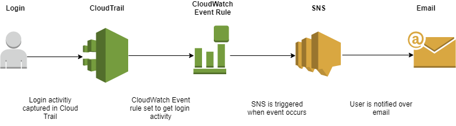
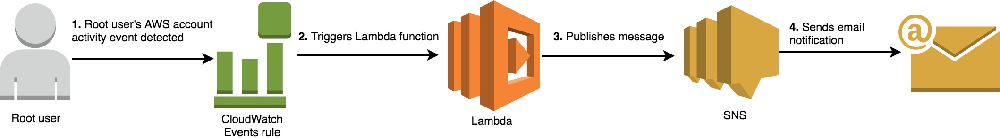

The best practice always is to create IAM logins for each user in an organization rather than sharing the root account. Most of the companies are following this trend as per their compliance regulations. But what if the root account is compromised by some way?

Yes. That can happen. It is recommended to enable two-factor authentication for the root account and even for all the IAM users. But it will be a wise idea to get notified if someone logins to console or make some API calls using the root credentials so that we can act fast. This can be done by the following steps.

1. Enable cloudtrail for all regions.
2. Create a cloudwatch rule to check for console login/API access for root user.
3. Enter the following as Event pattern

```
{
  "detail-type": [
    "AWS API Call via CloudTrail",
    "AWS Console Sign In via CloudTrail"
  ],
  "detail": {
    "userIdentity": {
      "type": [
        "Root"
      ]
    }
  }
}
```


4\. Select the target as an SNS topic for “Matched event” and select the Topic you are planning to subscribe to. (Assuming we have already created an SNS topic).



This way, we will get notified when root user does something. If we want to get email, go to SNS and create an email subscriber.

The above is the basic way to check for root activity. But, we can tune this better by including AWS lambda here.



AWS blog already have very detailed documentation on how to do this. So, I am not repeating that here. Please refer the link which includes a cloud formation template and lambda function which means you can simply spin up the stack in few minutes. I have used this personally and is working great.

<https://aws.amazon.com/blogs/mt/monitor-and-notify-on-aws-account-root-user-activity/>