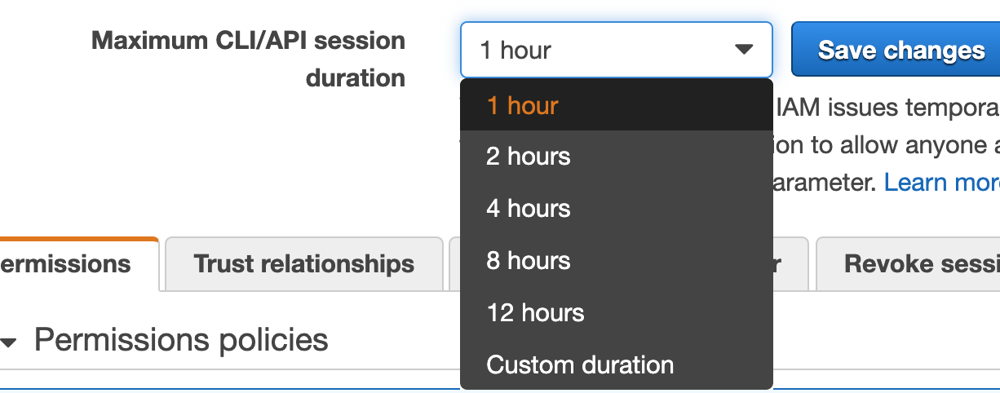

This will be useful for you if you are using profile in aws CLI configuration files for switching roles with 2FA enabled. An example configuration as follows.

```
[default]
output = json
region = us-east-1

[profile staging]
role_arn = arn:aws:iam::1234567890:role/staging
mfa_serial = arn:aws:iam::12345678909:mfa/devopslife
source_profile = default
region = us-east-1

[profile production]
role_arn = arn:aws:iam::1234567123:role/production
mfa_serial = arn:aws:iam::12345678909:mfa/devopslife
source_profile = default
region = us-east-1

```


As per the example configuration above, we can execute AWS CLI commands in multiple AWS accounts by specifying the profile. I am not explaining the Role switching setup here. Consider the scenario, If you have a 2FA configured as mandatory while doing a role switch, we have to enter the 2FA token for running AWS commands every one hour even though the session duration set for the role is more than that. We can avoid this by appending the following parameter in the AWS config.

```
duration_seconds = 43200
```


So, the whole code block will look like this

```
[profile production]
role_arn = arn:aws:iam::1234567123:role/production
mfa_serial = arn:aws:iam::12345678909:mfa/devopslife
source_profile = default
region = us-east-1
duration_seconds = 43200
```


43200 seconds(12 hours) is the maximum that we can set . Make sure to adjust the role’s maximum session duration in IAM as well for this to work.




We can verify by this by checking the expiration date in the aws cli cache JSON file which will be residing inside the .aws/cli/cache path.

```
grep -o -P '.{0,1}Expiration.{0,25}' $(find ~/.aws/cli/cache -name "*.json"|tail -1)

"Expiration": "2019-06-03T13:58:09Z"
```


This parameter works well if you are [using sessions in boto3](https://devopslife.io/using-profiles-in-boto3/) as well.