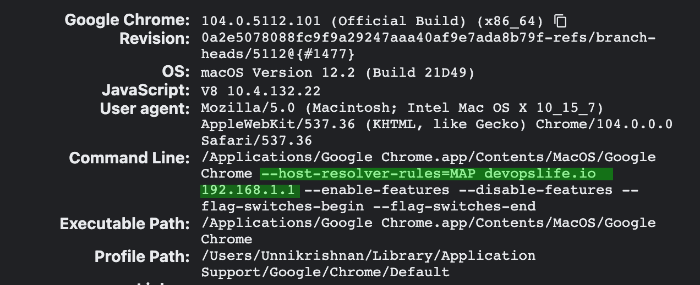

It is quite easy to resolve a domain locally using the /etc/hosts file. Similar thing can be done by editing the hosts file in windows which is located at c:\Windows\System32\Drivers\etc\hosts. But this can be done only if we have Admin access. This article focus primarily on how to resolve the dns locally using google chrome browser when you are not an admin user. 

The cool part is that this doesnt even need to install any chrome extensions as well. All we need to do is to start chrome with a flag. Examples as follows. 

If you are in windows, either run the following command in run prompt (windows key + R ) or edit google chrome shortcut and append the switch there. 


```chrome.exe --host-resolver-rules="MAP devopslife.io 192.168.1.1"```

If you are on Mac, you can invoke chrome from the terminal by calling the path along with switch. This path may slightly vary depends on the version. But it isnt really hard to find. 

```/Applications/Google\ Chrome.app/Contents/MacOS/Google\ Chrome --host-resolver-rules="MAP devopslife.io 192.168.1.1"```

If we want to supply multiple rules, it can be done by appending one after another separated with a comma. 

```chrome.exe --host-resolver-rules="MAP devopslife.io 192.168.1.1, MAP devopslife.com 192.168.1.2"```


You can validate if the above switch have taken effect by going to this url. 

```chrome://version```



If it is not showing there, is is because there might be some background process running for chrome. Make sure there are no google chrome process running before we start chrome with the switch. Task manager may comes handy for you to kill the process if you are in windows. If you are in linux, then you may use pkill. 


### Checkout the references
<p><a href="https://datacadamia.com/web/browser/chrome#dns_resolver" target="_blank" rel="noopener noreferrer"> https://datacadamia.com/web/browser/chrome#dns_resolver</a></p>
